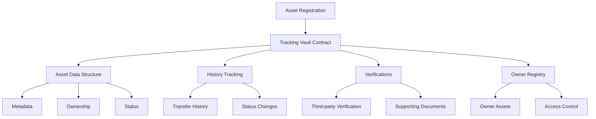

# 🔒 Upgrade Specification: Asset Tracking and Verification System

## Overview

The **Upgrade Specification** is a comprehensive Clarity smart contract designed to provide secure, transparent, and immutable asset tracking on the Stacks blockchain. This project enables robust management of digital and physical assets through a sophisticated tracking and verification mechanism.

### Key Features

- 📦 Detailed Asset Registration
- 🔍 Comprehensive Ownership Tracking
- 🛡️ Third-Party Verification Support
- 🔒 Secure Asset Lifecycle Management

## Problem Solved

In today's complex asset ecosystem, maintaining accurate, verifiable records of ownership and asset history is challenging. The Upgrade Specification addresses this by providing:

- Immutable asset registration
- Transparent ownership transfer logs
- Flexible metadata management
- Secure attestation and verification processes

## Technical Architecture

### Core Components

1. **Asset Registration**
   - Unique asset identifiers
   - Comprehensive metadata storage
   - Active/Inactive status management

2. **Ownership Tracking**
   - Detailed transfer history
   - Principal-based ownership verification
   - Historical ownership logs

3. **Verification System**
   - Third-party attestation support
   - Flexible verification type
   - Secure, timestamped verification records

### System Diagram



## Getting Started

### Prerequisites

- Stacks Blockchain
- Clarinet Development Environment
- Basic understanding of Clarity Smart Contracts

### Installation

```bash
git clone https://github.com/your-org/upgrade-specification.git
cd upgrade-specification
clarinet check
clarinet test
```

## Usage Example

```clarity
;; Register a new asset
(define-public (register-new-asset 
  (description (string-ascii 256))
  (value uint)
  (metadata-uri (optional (string-utf8 256)))
)
  ;; Implementation details
)

;; Transfer asset ownership
(define-public (transfer-asset 
  (asset-id uint)
  (new-owner principal)
)
  ;; Implementation details
)
```

## Contract Functions

### Public Functions

#### `update-asset-details`
Updates asset metadata (restricted to current owner)
```clarity
(define-public (update-asset-details
  (asset-id uint)
  (description (string-ascii 256))
  (value uint)
  (condition (string-ascii 64))
  (metadata-uri (optional (string-utf8 256)))
)
```

#### `add-asset-verification`
Add third-party verification/attestation
```clarity
(define-public (add-asset-verification
  (asset-id uint)
  (verification-type (string-ascii 64))
  (verification-details (string-utf8 256))
  (verification-uri (optional (string-utf8 256)))
)
```

### Read-Only Functions

#### `get-asset-details`
Retrieve asset information
```clarity
(define-read-only (get-asset-details (asset-id uint)))
```

#### `get-owner-assets`
List assets owned by a principal
```clarity
(define-read-only (get-owner-assets (owner principal)))
```

## Security Considerations

- Ownership-restricted operations
- Input validation at every stage
- Immutable historical tracking
- No direct fund transfers in the contract

### Error Handling

Comprehensive error codes protect against:
- Unauthorized access
- Invalid asset operations
- Ownership verification failures

## Development

### Testing
```bash
clarinet test
```

### Local Development
```bash
clarinet console
```

## Contributing

1. Fork the repository
2. Create your feature branch
3. Commit your changes
4. Push to the branch
5. Create a new Pull Request

## License

MIT License

## Contact

[Your Contact Information]